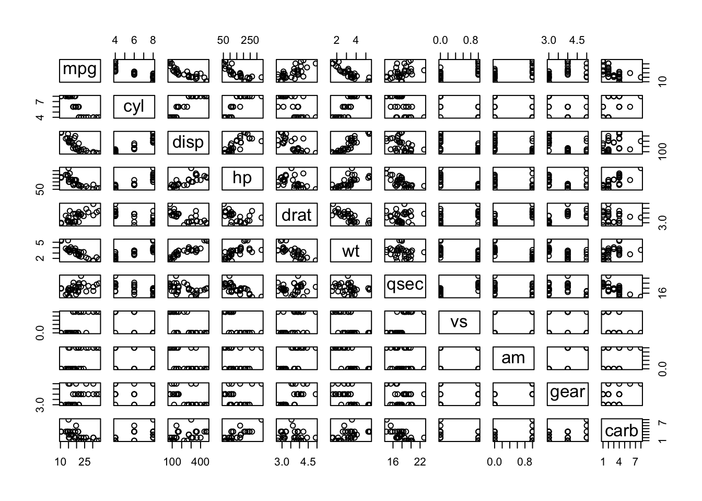
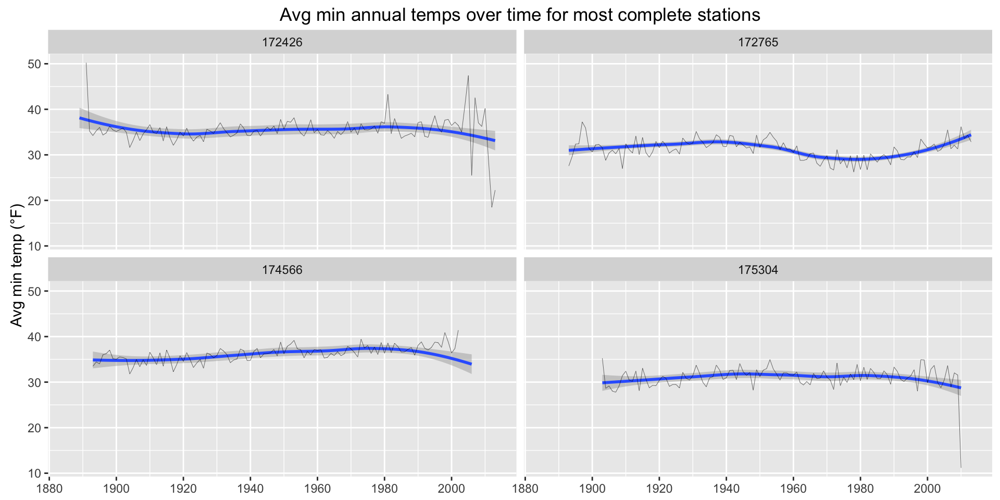
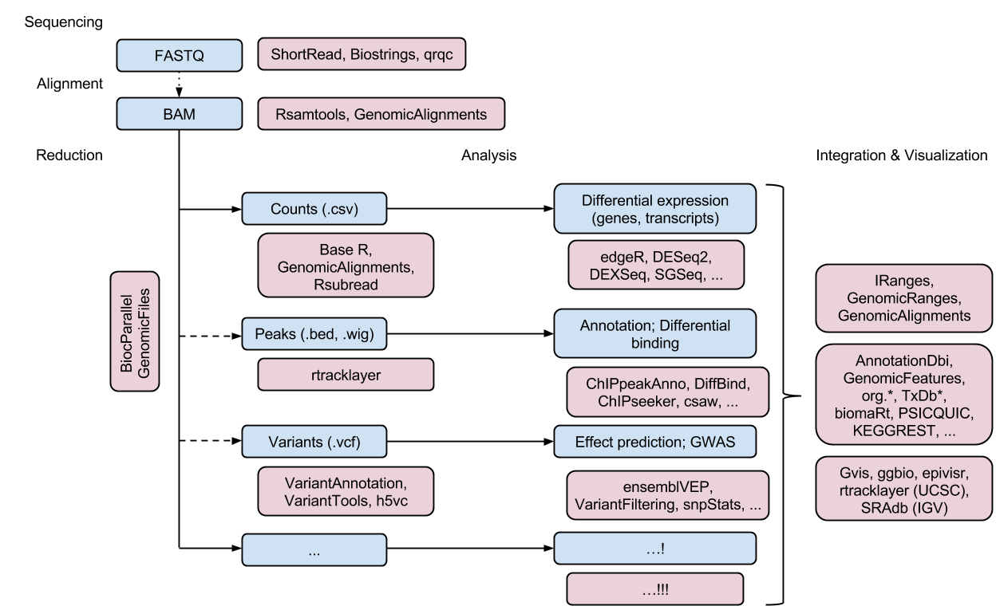

# WPI Intro to R Handout
Bob Rudis (@hrbrmstr)  
`r Sys.Date()`  
<!-- 
     TO USE THE hrbrmrkdn::wpi TEMPLATE YOU WILL NEED TO:

     install.packages("devtools")
     devtools::install_github("hrbrmstr/hrbrmrkdn") 
     
     You can alternately swap out "hrbrmrkdn::wpi:" with "rmarkdown::html_document:"
-->

To work with any of the more useful materials from the workshop you will need a working R &amp; RStudio installation.

# Installing R

Head on over to <https://cran.rstudio.com/> and follow the download instructions for the platform you are using.

## Mac folk:

Please also:

- install [XQuartz](http://www.xquartz.org/)
- open up `Terminal.app` and enter: `xcode-select --install` (this could take a bit)

## Windows folk

- Please also install [Rtools](https://cran.rstudio.com/bin/windows/Rtools/Rtools32.exe)

## Linux folk

- We need to talk :-)

# Installing RStudio

Next, head to <http://www.rstudio.com/download> and download/install the version of RStudio for the platform you are using.

<center></center>

# Validating the install

If all has gone well, you should be able to double-click the RStudio application icon and see the default application window/layout.

<center></center>

# A brief introduction to RStudio

RStudio is an integrated development environment for working with data science projects. Notice I didn't say just "R". While RStudio is amazingly good at helping you work with the R ecosystem, it's also good at helping you edit & view:

- HTML, CSS & javascript files
- C/C++ source code files
- Python code files
- XML & JSON files

By default there are four panes that you can configure to fit your aesthetic preferences. These can hold:

- Source code **Editor**
- R **Console** (where you can directly interact with R)
- R command execution **History** (see what you've already executed)
- **Environment** (objects you've created), **Files** (filesystem browser), **Plots** (viewing of static plots), **Packages** (visual package installer/remover/updater), **Help** (online R help), **Viewer** (interactive widgets/HTML viewer)

Since the R console is already up, let's give you a feel for the power of this fully armed and operational data science station. At the console prompt (<code>&gt;</code>) type the following:


```r
plot(mtcars)
```



You should see that scatterplot matrix of every combination of observations in something called `mtcars` in the **Plots** pane. Go ahead, text your Excel friends about your newfound Jedi Data Force powers. We'll wait.

# Ready Player One (Getting started with R/RStudio)

When you startup R (or RStudio), you're loading an _interactive_ program. Instead of pointint & clicking, you're typing. We're going to (at first) focus on learning to interact with R in the context of RStudio. You've actually already done this with the `plot` experience above. Generally speaking, what you do in R is pretty basic:

- you put things into memory (like data, kinda like loading a spreadsheet into Excel)
- you ask R to perform operations on the things in memory (like adding, subtracting, perform linear regression, make pretty plots)
- you create sequences of operations for R to perform on things in memory (we often wrap those sequences of operations in something called a _function_)
- you ask R to save output of those operations (make a CSV file, output a plot to a `png` or `pdf` file, upload things to servers)

Let's start with the _"put things into memory"_ bit byt having R (temporarily) remember who you are. We do this by giving R the name of the object that will hold your name and then assigning the value of your name to that object. It's easier to show you this, tho.


```r
i_am <- "Batman"
```

You can type that into the R console directly and hit `Enter` or into a new source editor tab, move to the code line and hit `Cmd` (or `Ctrl`) `Enter`. You should see this in your RStudio **Environment** tab:

<center></center>

If you want to use some more Jedi powers, you can also do:


```r
ls()
[1] "i_am"

print(i_am)
[1] "Batman"

cat(i_am)
Batman
```

The `ls()` function (we'll define a function more formally in a bit) shows the name of every object that's been created in the current _environment_ (which, to oversimplify, is the memory assocaited with the currently running R application).

Every R object knows how to print itself when it's told to. Since `i_am` is holding a string of characters, what it knows how to do when asked to `print()` itself is to return the characters it's holding. the `[1]` will make more sense in a bit, but for now that's R telling you there was one character string in `i_am`.

The `cat()` function is a bit different than it's `print()` counterpart. `print()`'s mission in life is to help you understand the makeup of an object in (sometimes) excrutiating detail. `cat()` really only cares about showing the character output of any object in a minimal a form as possible (hence, why it didn't bother to tell you there was only one string of characters).

But R can hold more than just characters:


```r
the_answer <- 42

pi <- 3.14159265359

nobility_is_exempt_from_fear <- TRUE
```

`print()` and `cat()` each of those. Go ahead. We'll wait.

What's that? What is this `<-` thing? I'm glad you asked!

## Assignment Operators (Spanish Inquisition-style)

R's *chief* assignment operator is `<-`; `<-` and `=`, `=` and `->`. Yes, it's **two** assignment operators are `<-`, `=` and `->`…It's **three** assignment operators are `<-`, `=`, `->` and `<<-`. Wait, it's **four** assignment operators are `<-`, `=`, `->`, `<<-` and...oh let me start again.

For now, we'll talk about three (yes there are more than even the four I've shown) of R's assignment operators:

- `<-` (your BFF assignment operator)
- `=` (a kitten dies whenever you use this one improperly)
- `->` (your second BFF assignment operator)

The arrow notation is one of the signals of R's foundation in statistics/maths. It was made by maths ppl and that will be evident in many places (usually the ones where you end up wanting to bash your head with a large brick, repeatedly). Think of the arrows like this:

- `<-` :: `OBJECT` _force pulls in_ `VALUE` (`=` works this way, too)
- `->` :: `VALUE` _is force pushed into_ `OBJECT`

The `->` syntax is only really used by insane people like me and you'll rarely see it in R code. I'l talk more about why `<-` is super-way-better than `=` a bit later. For now, just go with `<-` as your default assignment operator and if you are getting a bit OCD about it being two characters then you can use a seekrit RStudio incantation (`Alt` or `Option` + `-`) to type it as if it was one character.

## About those maths…

Storing your name in R is all well and good but you'll probably want to eventually do some maths in R to, perhaps, cure cancer or find cybercriminals. Unsurprisingly, this works much like you've done on a calculator or in an Excel forumla:


```r
1 + 1                  # addition
[1] 2

7 / 3                  # division
[1] 2.333333

4 - 2                  # subtraction
[1] 2

100 * 100              # multiplication
[1] 10000

3.14159265359 * 4 ^ 2  # ^ :: raise to the power of
[1] 50.26548
```

You can reference values of objects in memory for these arithmetic operations and store the result of the arithmetic operations in memory:


```r
the_answer * 2
[1] 84

nothing <- the_answer - the_answer
print(nothing)
[1] 0
```

We'll do more maths a bit later on.

Note that you can't do maths on strings of characters:


```r
"Bat" + "man"
Error in "Bat" + "man" : non-numeric argument to binary operator
```

(I guess emotionally disturbed superheroes aren't welcome in R).

## Vectors (a.k.a. "Putting things on top of other things")

If all we could do is work with individual values, we might be better off using a TI-84 calculator. As you collect readings from your scientfic work, you generally keep groups of similar observations together and want to perform operations on those observations. Some languages call these groups of values _arrays_, you may call them _columns_ in Excel. In R, we call them `vectors`.

There are many ways to create a vector, either by specifying them directly in an R script/program or reading them in from data sources or spontaneously creating them from those mysterious `functions` we haven't really shown you yet. For now, we'll create a vector of historical annual snowfall amounts (in inches) on February 10 in Worcester dating back 48 years:


```r
worcester_snow <- c(0, 0, 1, 0, 0, 4, 0, 0, 0.5, 0, 2.5, 2, 17, 0, 0, 0, 0, 0, 
                    2, 0, 0, 0, 0, 0, 0, 3, 0, 0, 0, 0, 3, 0, 0, 0, 0, 0, 0, 3, 
                    0, 0, 0, 0, 0, 0, 0, 0, 0, 0)
```

I know we're learning about `vectors` but you should also note that we had an assignment operation span more than one line of code there. R is not space-sensitive like some other (lesser) data science languages, but it _does_ let you use spaces to keep you code tidy & readable.

The `c()` is the R **combine** operator. It expects objects of similar type to be separated by commas and will store them all in the given variable name (I'll alternate beteen `object` and `variable` since they are _pretty much_ the same thing most of the time). Despite `0` and `1` looking like integers, the fact that there's a `0.5` in there will cause R to make them all real/floating point numbers. Don't believe me? Take a look:


```r
print(worcester_snow)
 [1]  0.0  0.0  1.0  0.0  0.0  4.0  0.0  0.0  0.5  0.0  2.5  2.0 17.0  0.0
[15]  0.0  0.0  0.0  0.0  2.0  0.0  0.0  0.0  0.0  0.0  0.0  3.0  0.0  0.0
[29]  0.0  0.0  3.0  0.0  0.0  0.0  0.0  0.0  0.0  3.0  0.0  0.0  0.0  0.0
[43]  0.0  0.0  0.0  0.0  0.0  0.0
```

Aha! Now you see what that `[1]` was all about eariler. Here, you see that R is trying to help you know how many items are in the vector `worcester_snow`. You can see that it's showing `0.0` and `1.0` for what initially looked like integers. We can use other means to see how many observations are in the vector and what type they are:


```r
length(worcester_snow)
[1] 48

class(worcester_snow)
[1] "numeric"
```

`length()` is straightforwrd enough (hopefully)

All R objects have some `class`. Classes are how R distinguishes between different types objects. This is easier to see than to hear:


```r
class("Batman")
[1] "character"

class(42L)
[1] "integer"

class(3.1415)
[1] "numeric"

class(TRUE)
[1] "logical"
```

What's that? What's this `L` after a number? R tries it's best to not break things (honest, it does!) so it defaults to using a `double`. What's a `double`?

>_Double-precision floating-point format is a computer number format that occupies 8 bytes (64 bits) in computer memory and represents a wide, dynamic range of values by using a floating point._

The `L` tells R we truly only want integers. `L`ong integers (32-bits).

The critical thing to remember about `vectors` is they they only store objects of the same "storage mode" (type) and R will coerce to the least common denominator. Meaning if you have, say:


```r
dont_do_this <- c("1", 2, 3.3333)
```

Then R will convert them all to characters:


```r
print(dont_do_this)
[1] "1"      "2"      "3.3333"

class(dont_do_this)
[1] "character"
```

You can access one or more individual elements in a vector by _indexing_. Say we wanted the first observation:


```r
worcester_snow[1]
[1] 0
```

that's really the same thing as saying:


```r
worcester_snow[c(1)]
[1] 0
```

because core types in R are really just single-element vectors.

Using that knowledge, we can easily retrieve the first and fifth observations:


```r
worcester_snow[c(1, 5)]
[1] 0 0
```

How about getting the first 10 observations?


```r
worcester_snow[c(1, 2, 3, 4, 5, 6, 7, 8, 9, 10)]
 [1] 0.0 0.0 1.0 0.0 0.0 4.0 0.0 0.0 0.5 0.0
```

This is a frequent enough operation that R has a shortcut way of defining a range of values:


```r
worcester_snow[1:10]
 [1] 0.0 0.0 1.0 0.0 0.0 4.0 0.0 0.0 0.5 0.0
```

In reality, `1:10` is just creating an unnamed vector:


```r
1:10
 [1]  1  2  3  4  5  6  7  8  9 10

length(1:10)
[1] 10

class(1:10)
[1] "integer"
```

We can use a handy feature of the `c()` _combine_ function which lets us **combine multiple vectors** into a new, single vector (we're kinda doing that anyway since all those numbers we've been using are single element vectors):


```r
c(1, 5, 9:15, 22, 30:33)
 [1]  1  5  9 10 11 12 13 14 15 22 30 31 32 33

worcester_snow[c(1, 5, 9:15, 22, 30:33)]
 [1]  0.0  0.0  0.5  0.0  2.5  2.0 17.0  0.0  0.0  0.0  0.0  3.0  0.0  0.0

idx <- c(1, 5, 9:15, 22, 30:33)

worcester_snow[idx]
 [1]  0.0  0.0  0.5  0.0  2.5  2.0 17.0  0.0  0.0  0.0  0.0  3.0  0.0  0.0
```

Why are these `vectors` important? Because working with them is what R was born to do. For instance, if we found out there was a glitch in the weather station hardware that subtracted `0.5` from each value in `worcester_snow`, we could compensate for it:


```r
worcester_snow <- worcester_snow + 0.5

print(worcester_snow)
 [1]  0.5  0.5  1.5  0.5  0.5  4.5  0.5  0.5  1.0  0.5  3.0  2.5 17.5  0.5
[15]  0.5  0.5  0.5  0.5  2.5  0.5  0.5  0.5  0.5  0.5  0.5  3.5  0.5  0.5
[29]  0.5  0.5  3.5  0.5  0.5  0.5  0.5  0.5  0.5  3.5  0.5  0.5  0.5  0.5
[43]  0.5  0.5  0.5  0.5  0.5  0.5
```

And, say we had the same historical data for a town in Maine. We could combine them to get total historical snowfall that day


```r
berwick_snow <- c(0, 0.2, 4, 4.5, 0, 0, 0, 0, 0, 0, 0, 0, 0, 0, 0, 0, 0.5, 0, 
                  0, 0, 0, 0, 0, 0, 0, 0, 0, 0, 0.1, 0, 0, 0, 0, 0, 0, 0, 0, 0.2, 
                  0, 9, 0, 0, 1.5, 0, 0, 0, 0, 0)

worcester_snow + berwick_snow
 [1]  0.5  0.7  5.5  5.0  0.5  4.5  0.5  0.5  1.0  0.5  3.0  2.5 17.5  0.5
[15]  0.5  0.5  1.0  0.5  2.5  0.5  0.5  0.5  0.5  0.5  0.5  3.5  0.5  0.5
[29]  0.6  0.5  3.5  0.5  0.5  0.5  0.5  0.5  0.5  3.7  0.5  9.5  0.5  0.5
[43]  2.0  0.5  0.5  0.5  0.5  0.5
```

Vectorized operations (maths or otherwise) are at the heart of R. If you're familiar with other (lesser) programming languages, you could do the same thing the tired, old way using **loops**:


```r
# make a new vector the hard way by allocating a vector object of a certain size
total_snow <- vector("numeric", length(berwick_snow))

# loop through and add each element together and assign it to our new vector
for (i in 1:length(total_snow)) {
  total_snow[i] <- worcester_snow[i] + berwick_snow[i]
}

print(total_snow)
 [1]  0.5  0.7  5.5  5.0  0.5  4.5  0.5  0.5  1.0  0.5  3.0  2.5 17.5  0.5
[15]  0.5  0.5  1.0  0.5  2.5  0.5  0.5  0.5  0.5  0.5  0.5  3.5  0.5  0.5
[29]  0.6  0.5  3.5  0.5  0.5  0.5  0.5  0.5  0.5  3.7  0.5  9.5  0.5  0.5
[43]  2.0  0.5  0.5  0.5  0.5  0.5
```

We don't need to use our eyes to validate the results, though:


```r
total_snow == (worcester_snow + berwick_snow)
 [1] TRUE TRUE TRUE TRUE TRUE TRUE TRUE TRUE TRUE TRUE TRUE TRUE TRUE TRUE
[15] TRUE TRUE TRUE TRUE TRUE TRUE TRUE TRUE TRUE TRUE TRUE TRUE TRUE TRUE
[29] TRUE TRUE TRUE TRUE TRUE TRUE TRUE TRUE TRUE TRUE TRUE TRUE TRUE TRUE
[43] TRUE TRUE TRUE TRUE TRUE TRUE

sum(total_snow == (worcester_snow + berwick_snow))
[1] 48
```

(I guess this would be a good time to introduce comparison operators…we'll come back to vectors and hit functions soon thereafter.)

## Comparison Operators (a.k.a. computing "swipe left/right" in R)

Maths are all well-and-good, but there will be times you want to test for things being `TRUE` or `FALSE`. For example, we may only want to look at non-zero historcal snowfall values for Berwick:


```r
berwick_snow > 0
 [1] FALSE  TRUE  TRUE  TRUE FALSE FALSE FALSE FALSE FALSE FALSE FALSE
[12] FALSE FALSE FALSE FALSE FALSE  TRUE FALSE FALSE FALSE FALSE FALSE
[23] FALSE FALSE FALSE FALSE FALSE FALSE  TRUE FALSE FALSE FALSE FALSE
[34] FALSE FALSE FALSE FALSE  TRUE FALSE  TRUE FALSE FALSE  TRUE FALSE
[45] FALSE FALSE FALSE FALSE
```

Well, that _almost_ worked. R tested each element for the condition we asked it to and told us whether it was `TRUE` or not (we saw something similar earlier). Thankfully R doesn't just support numeric indexing. We can use the results of our conditional (a.k.a. _logical_ or _boolean_) test to retrieve only the `> 0` results:


```r
berwick_snow[berwick_snow > 0]
[1] 0.2 4.0 4.5 0.5 0.1 0.2 9.0 1.5
```

Who, wha? We can do that in multiple steps if that seems confusing:


```r
had_snow <- berwick_snow > 0

berwick_snow[had_snow]
[1] 0.2 4.0 4.5 0.5 0.1 0.2 9.0 1.5
```

If we want to know the positions rather than the values, there's a way to do that, too:


```r
which(berwick_snow > 0)
[1]  2  3  4 17 29 38 40 43
```

(R is pretty much doing that under the covers for you)

You can get as complex as you like with those logical comparisons. Here's all the snowfall amounts that are greater than 1/10th of an inch and less than or equal to one inch:


```r
berwick_snow[(berwick_snow > 0.1 & berwick_snow <= 1.0)]
[1] 0.2 0.5 0.2
```

## Vector (Special) Ops

You've done some simple maths and logical comparisons, plus some extractions that were smoother than the bestest densist visit. Since you're already Doing Science! you're used to more maths operations than simple arithmetic. Luckily, R knew you'd want that and provides some built right in:

- `abs`, `sign`, `sqrt`, `floor`, `ceiling`, `trunc`, `round`, `signif`
- `exp`, `log`, `expm1`, `log1p`, 
- `cos`, `sin`, `tan`, 
- `cospi`, `sinpi`, `tanpi`
- `acos`, `asin`, `atan`
- `cosh`, `sinh`, `tanh`, 
- `acosh`, `asinh`, `atanh`
- `sum`, `max`, `min`, `range`
- `cumsum`, `cumprod`, `cummax`, `cummin`

They are _functions_ that operate on vectors. While the functionality of some of those are probably obvious, you can see what each one does by using the _help system_ in R:


```r
help(cumsum)
help(round)
?exp
```

(`?thing` is just shorthand for `help(thing)`)

Sometimes these return the same number of elements as the input vecor:


```r
abs(berwick_snow)
 [1] 0.0 0.2 4.0 4.5 0.0 0.0 0.0 0.0 0.0 0.0 0.0 0.0 0.0 0.0 0.0 0.0 0.5
[18] 0.0 0.0 0.0 0.0 0.0 0.0 0.0 0.0 0.0 0.0 0.0 0.1 0.0 0.0 0.0 0.0 0.0
[35] 0.0 0.0 0.0 0.2 0.0 9.0 0.0 0.0 1.5 0.0 0.0 0.0 0.0 0.0
```

other times they return a single value:


```r
sum(berwick_snow)
[1] 20

max(berwick_snow)
[1] 9

min(berwick_snow)
[1] 0
```

or other sized values (can be more or less):


```r
range(berwick_snow)
[1] 0 9

cummax(berwick_snow)
 [1] 0.0 0.2 4.0 4.5 4.5 4.5 4.5 4.5 4.5 4.5 4.5 4.5 4.5 4.5 4.5 4.5 4.5
[18] 4.5 4.5 4.5 4.5 4.5 4.5 4.5 4.5 4.5 4.5 4.5 4.5 4.5 4.5 4.5 4.5 4.5
[35] 4.5 4.5 4.5 4.5 4.5 9.0 9.0 9.0 9.0 9.0 9.0 9.0 9.0 9.0
```

(Try running those same operations - and other ones in the list - on `worcester_snow`)

We can also perform logical tests that result in a single value return. There's a function: `any` which will let us know if there are any values in a vector that meet a certain condition:


```r
any(berwick_snow >= 9)
[1] TRUE
```

We can also see if `all` of the elements of an array meet certain conditions:


```r
all(berwick_snow >= 0.1)
[1] FALSE
```

# Level Up! (a.k.a. Intermediate R/RStudio)

You've had some practice time to:

- execute code in the R console
- execute code in an RStudio editor pane
- learn a bit about vectors
- inspect data in the R environment
- play with vectors, maths, logical operators and some built in functions

Now, we can start the fun stuff.

## Working with (real) data

Unsurprisingly, R has many built in statistical functions (try `help(stats)`) and _loads_ of add-ons with even more. We'll use some of them to take a look at data. But, let's be honest, R doesn't expect you to type in a vector of data to work on it and it's unlikely you only have a small, single vector of values to work with. You probably record observational data into a spreadsheet (or 12) and you may even work with sensors and software that export data into formats you can use in a spreadsheet. 

We're going to work with _all_ recorded weather data for Berwick, Maine in this next exercise. But before we do that you need to know about two other object types in R, the `list` and `data.frame`.

Vectors are like egg cartons. They hold eggs and just eggs. In a perfect grocery shopping world you're not going to bring home a carton of jumbo brown eggs and see a mixture of different egg sizes & colors.

An R `list` is like your grocery bag where you may have cartons of eggs, bags of different vegetables, packages of meat and cans & boxes of other pantry items. But, `list`s are actually even more like the trunk of your car which could have many grocery bags, a spare tire, emergency kit (which contains other things), tarps and a blanket. A `list` is really just a container that can hold pretty much anything, including other `list`s:


```r
container <- list(flavors=c("cherry", "vanilla", "chocolate"),
                  attendees=c(30142, 12312, 9210, 22165),
                  lucky_number=7,
                  r_is_awesome=TRUE,
                  another_container=list(name="Skywalker",
                                         father="Vader",
                                         sister="Leia",
                                         droids=c("R2-D2", "C-3PO"),
                                         number_of_kids=2,
                                         death_stars_destroyed=2))

str(container)
List of 5
 $ flavors          : chr [1:3] "cherry" "vanilla" "chocolate"
 $ attendees        : num [1:4] 30142 12312 9210 22165
 $ lucky_number     : num 7
 $ r_is_awesome     : logi TRUE
 $ another_container:List of 6
  ..$ name                 : chr "Skywalker"
  ..$ father               : chr "Vader"
  ..$ sister               : chr "Leia"
  ..$ droids               : chr [1:2] "R2-D2" "C-3PO"
  ..$ number_of_kids       : num 2
  ..$ death_stars_destroyed: num 2
```

`str()` is a function that lets you examine the `str`ucture of an R object. It's really handy for lists but can also be overwhelming if a list is big.

It also works on plain, ol' vectors but is not as impressive:


```r
str(berwick_snow)
 num [1:48] 0 0.2 4 4.5 0 0 0 0 0 0 ...
```

Note that this is one of only a handful of circumstances where the use of `=` does not cause the demise of tiny felines.

Why does such a beast exist? One reason is that it lets you keep things that are related to each other with each other. For instance, when you run a linear regression over data (assuming you've done some of that by hand or in another program), it'd be handy to have one variable name to use to track the coefficients, residuals and fitted values of the results vs having to always deal with three of them). 

What do `list`s have to do with a `data.frame`? Well, a `data.frame` is a special container that holds vectors of equal length which means you can have one set of observations per vector and keep them all together, just like you would columns of a spreadsheet.

We can make a `data.frame` out of our snow measurements:


```r
snow <- data.frame(worcester=c(0, 0, 1, 0, 0, 4, 0, 0, 0.5, 0, 2.5, 2, 17, 0, 0, 0, 0, 0, 
                               2, 0, 0, 0, 0, 0, 0, 3, 0, 0, 0, 0, 3, 0, 0, 0, 0, 0, 0, 3, 
                               0, 0, 0, 0, 0, 0, 0, 0, 0, 0),
                   berwick=c(0, 0.2, 4, 4.5, 0, 0, 0, 0, 0, 0, 0, 0, 0, 0, 0, 0, 0.5, 0, 
                             0, 0, 0, 0, 0, 0, 0, 0, 0, 0, 0.1, 0, 0, 0, 0, 0, 0, 0, 0, 0.2, 
                             0, 9, 0, 0, 1.5, 0, 0, 0, 0, 0))
print(head(snow))
  worcester berwick
1         0     0.0
2         0     0.2
3         1     4.0
4         0     4.5
5         0     0.0
6         4     0.0

str(snow)
'data.frame':	48 obs. of  2 variables:
 $ worcester: num  0 0 1 0 0 4 0 0 0.5 0 ...
 $ berwick  : num  0 0.2 4 4.5 0 0 0 0 0 0 ...
```

`head()` is a convenience function that will show only the first `n` (by default `6`) elements of an object (it has sister function `tail()` which does the same in reverse…they are handy for inspecting data without spitting out the whole thing).

Note that this is another of only a handful of circumstances where the use of `=` does not cause the demise of tiny felines.

If you were looking at that `snow` `data.frame` in a spreadsheet, it might look like this (only larger if it had all the values):

<!--html_preserve--><div id="htmlwidget-1360" style="width:672px;height:200px;" class="rhandsontable"></div>
<script type="application/json" data-for="htmlwidget-1360">{"x":{"data":[{"worcester":0,"berwick":0},{"worcester":0,"berwick":0.2},{"worcester":1,"berwick":4},{"worcester":0,"berwick":4.5},{"worcester":0,"berwick":0},{"worcester":4,"berwick":0}],"rClass":"data.frame","rColClasses":{"worcester":"numeric","berwick":"numeric"},"rColnames":["worcester","berwick"],"selectCallback":false,"colHeaders":["worcester","berwick"],"rowHeaders":["1","2","3","4","5","6"],"columns":[{"type":"numeric","format":"0.00","readOnly":true,"renderer":"customRenderer","default":null},{"type":"numeric","format":"0.00","readOnly":true,"renderer":"customRenderer","default":null}],"width":null,"height":"200","stretchH":"none","comments":false,"contextMenu":{"items":{"row_above":[],"row_below":[],"remove_row":[],"hsep1":{"name":"---------"},"undo":[],"redo":[],"hsep2":{"name":"---------"},"alignment":[]}}},"evals":["columns.0.renderer","columns.1.renderer"]}</script><!--/html_preserve-->

`data.frame`s are _rectangular_ data sets (i.e. collections of values that are each associated with a variable and an observation). We're going to work with rectangular data and components of rectangular data for the remainder of the workshop. R has another data type -- `matrix` -- that, well holds matricies. We're not going to focus on those, but R is a matrix processing _powerhouse_ and some of the tools that work on `matrix` structures also work on `data.frames`.

Let us forsake this toy data and use some real data to continue our `data.frame discussion.

## Reading in (real) data

There's really not enough time in a 4-ish hour workshop to make you an expert in any area of data analysis with R, let alone all of it. We're going to keep this reading-in part simple since data munging is an exhaustive topic in and of itself. Rather than try to read Excel documents (R can do that), we'll work with a CSV (comma separated values) file. This particular CSV file is all historical daily min & max temperature readings from all stations in Maine. You're going to read it in from the internet.


```r
#wx <- read.csv("http://dds.ec/dl/temps.csv", stringsAsFactors=FALSE)
wx <- read.csv("temps.csv", stringsAsFactors=FALSE)
```

(`stringsAsFactors=FALSE` is a parameter we pass into `read.csv` to tell R to not muck with our data any more than it already does)

You've just read in a ~22MB file into R. What's in it? 


```r
str(wx)
'data.frame':	648308 obs. of  4 variables:
 $ station_id: int  170100 170100 170100 170100 170100 170100 170100 170100 170100 170100 ...
 $ date      : chr  "1982-09-01" "1982-09-02" "1982-09-03" "1982-09-04" ...
 $ element   : chr  "TMAX" "TMAX" "TMAX" "TMAX" ...
 $ value     : int  70 66 68 72 69 72 71 65 65 77 ...
```

Well, ~640K observations. That's quite a bit. We can get a better overview with the `summary()` function:


```r
summary(wx)
   station_id         date             element              value       
 Min.   :170100   Length:648308      Length:648308      Min.   :-54.00  
 1st Qu.:172426   Class :character   Class :character   1st Qu.: 28.00  
 Median :173046   Mode  :character   Mode  :character   Median : 43.00  
 Mean   :173557                                         Mean   : 43.18  
 3rd Qu.:175304                                         3rd Qu.: 59.00  
 Max.   :176937                                         Max.   :136.00  
                                                        NA's   :1       
```

That provides an overview of the contents of each column (vector of values) in the `data.frame`

Now, `station_id` is not really numeric. It's an identifier that just happens to use digits. Ideally, we'd like to know how many different stations are in this data set.

Similarly, while `date` is represented by a string of characters in "`YYYY-MM-DD`" format, it'd be better if it were an actual "date" (it's a good thing R has a `Date` type!). 

`element` is similar to `station_id` in that the characters represent a kind of reading (min or max temperature).

Finally, `value` seems to be OK and we can see the summary stats for it, but what's this `NA` thing?

We deliberately used that `stringsAsFactors` parameter because R will turn every string of characters into something called a `factor` if we don't. Most of the time (with "modern" data & tools) we don't want `factors` by default (especially if we're performing operations on character data or have to seriously munge data to get it into a usable format). We're going to change the object type of `station_id` and `element` to `factor` (i.e. change `station_id` from a continuous variable to a bounded categorical one and deliberately make `element` a categorical variable with known bounds). We'll also make `date` into a real `Date` object (and we'll come back to those `NA`s in a bit).

We need to access the individual vectors in `wx` to change them. There are a few ways to do that in R, but we'll use the `$` operator for now:


```r
head(wx$station_id)
[1] 170100 170100 170100 170100 170100 170100

head(wx$date)
[1] "1982-09-01" "1982-09-02" "1982-09-03" "1982-09-04" "1982-09-05"
[6] "1982-09-06"
```

We can use the same syntax to actually modify those vectors (just like we did waaaay back up there).


```r
wx$station_id <- factor(wx$station_id)

wx$date <- as.Date(wx$date)

wx$element <- factor(wx$element)

str(wx)
'data.frame':	648308 obs. of  4 variables:
 $ station_id: Factor w/ 11 levels "170100","170814",..: 1 1 1 1 1 1 1 1 1 1 ...
 $ date      : Date, format: "1982-09-01" "1982-09-02" ...
 $ element   : Factor w/ 3 levels "","TMAX","TMIN": 2 2 2 2 2 2 2 2 2 2 ...
 $ value     : int  70 66 68 72 69 72 71 65 65 77 ...
```

The `factor()` function turned those vectors of strings and numnbers into `Factor` objects (note the case). The _levels_ of a factor are how many disctinct values it holds (i.e. ther are 11 stations and 2 element observation types). You can do more with factors than this, but we've done enough (for now).

If you are lucky enough to have dates in "`YYYY-MM-DD`" format, then yoou can get away with converting them to an actual `Date` object (i.e. a numerical value representation with an ordered, categorical nature). If you aren't, R has many ways to help you work with them (just not in this workshop).

Let's re-run the `summary()` function again:


```r
summary(wx)
   station_id          date            element           value       
 173046 : 89969   Min.   :1886-09-01       :     1   Min.   :-54.00  
 172765 : 87522   1st Qu.:1933-09-24   TMAX:324131   1st Qu.: 28.00  
 172426 : 84658   Median :1962-10-17   TMIN:324176   Median : 43.00  
 174566 : 80129   Mean   :1960-03-13                 Mean   : 43.18  
 175304 : 77588   3rd Qu.:1989-07-30                 3rd Qu.: 59.00  
 176905 : 53436   Max.   :2013-12-31                 Max.   :136.00  
 (Other):175006   NA's   :1                          NA's   :1       
```

Muuuuuch more useful. We can now see the number of observations for each `station_id` & `element` and also see the range of `date`s we have to work with. If we want to see all the factor levels for `station_id`, we can add a parameter to `summary` to have it show all the factor levels:


```r
summary(wx, maxsum=max(nlevels(wx$station_id), nlevels(wx$element)))
  station_id         date            element           value       
 170100:22416   Min.   :1886-09-01       :     1   Min.   :-54.00  
 170814:50501   1st Qu.:1933-09-24   TMAX:324131   1st Qu.: 28.00  
 171628:47321   Median :1962-10-17   TMIN:324176   Median : 43.00  
 172426:84658   Mean   :1960-03-13                 Mean   : 43.18  
 172765:87522   3rd Qu.:1989-07-30                 3rd Qu.: 59.00  
 173046:89969   Max.   :2013-12-31                 Max.   :136.00  
 173944:20636   NA's   :1                          NA's   :1       
 174566:80129                                                      
 175304:77588                                                      
 176905:53436                                                      
 176937:34132                                                      
```

Who, whaa? Pretend we didn't know the number of levels of each of our factors (or didn't want to type in the number manually). We can get the number of levels for factor with the `nlevels()` function, do that for both factor objects and then ask `max()` to tell us which is the largest value. By adding some variable computation to your analysis/reporting scripts, you can save some repeated, manual typing time.

But we've still got that `NA` thing in `value` and another in `date`. What's up with `NA`? It's just R's way to telling you there's a missing/invalid value around. `NA`s show up when things do go as expected (like the `date` string conversion to a `Date` object) or if a value can't be coerced to fit with the data type of it's container.

Sometimes `NA`s are OK to keep around (we can impute--algorithmically/statistically fill in--missing values if appropriate to the analysis we're working on). Other times we need complete sets of observations to work with and the `NA`s are a pain. This is such a common occurrence that R has a way to tell if the observations are complete or not:


```r
wx <- wx[complete.cases(wx),]

summary(wx)
   station_id          date            element           value       
 173046 : 89969   Min.   :1886-09-01       :     0   Min.   :-54.00  
 172765 : 87522   1st Qu.:1933-09-24   TMAX:324131   1st Qu.: 28.00  
 172426 : 84658   Median :1962-10-17   TMIN:324176   Median : 43.00  
 174566 : 80129   Mean   :1960-03-13                 Mean   : 43.18  
 175304 : 77588   3rd Qu.:1989-07-30                 3rd Qu.: 59.00  
 176905 : 53436   Max.   :2013-12-31                 Max.   :136.00  
 (Other):175005                                                      
```

What did that do? Well, remmeber back to vector _indexing_ and how it could be numeric or logical? We can do the same with a `data.frame`, but a `data.frame` has two dimensions, rows and columns. The first index (the one before the `,`) is in the "y" direction (i.e. row index). When we run `complete.cases()` on a `data.frame`, it knows how to look at each column and returns `TRUE` if all the columns have no `NA` values. By adding the comma and not specifying the column indexes (or names) we want returned, we get them all. We could also have done:


You may have already guessed that we can use similar syntax to see just a subset of the columns:


```r
str(wx[,"station_id"])
 Factor w/ 11 levels "170100","170814",..: 1 1 1 1 1 1 1 1 1 1 ...

str(wx[,c("station_id", "value")])
'data.frame':	648307 obs. of  2 variables:
 $ station_id: Factor w/ 11 levels "170100","170814",..: 1 1 1 1 1 1 1 1 1 1 ...
 $ value     : int  70 66 68 72 69 72 71 65 65 77 ...
```

We _still_ have a problem, though. Not every station has every reading on every day. I think we're going to need to call in a couple members of the data munging Justice League to give us a hand with this villianous `data.frame`.

## Loading packages

R has _tons_ of functionality built-in. It also has ~7,900 separate packages of data and functions that have more statistical operations, data visualization tools and additional data you can work with directly or augment your own data with. We're going to load three packages into R. Two will help us with data munging and one is for making useful (and pretty) plots. 

You can [persue all the packages avaialble](https://cran.rstudio.com/web/packages/) as you like and find [recommendations for topic specific ones](https://cran.rstudio.com/web/views/). To help us tame this `data.frame` we'll need to load two specific ones: [`tidyr`](https://cran.rstudio.com/web/packages/tidyr/index.html) and [`dplyr`](https://cran.rstudio.com/web/packages/dplyr/index.html). We'll load [`ggplot2`](https://cran.rstudio.com/web/packages/ggplot2/index.html) for data vis help.


```r
# this will take a bit and we may need to do some troubleshooting on Windows cuz…_Windows_
install.packages(c("tidyr", "dplyr", "ggplot2")) 

library(tidyr)
library(dplyr)
library(ggplot2)
```


Let's start cleaning data with `tidyr`. First, we'll take this _long_ data frame (one observation per row) and make it a bit _wide_r (a column for each observation type):


```r
wx_long <- spread(wx, element, value)
```

We just asked R to _spread_ out each disctinct category of `element` into their own columns. This inherently meant filling in values (with `NA`s) where there weren't any (for whatever reason).


```r
nrow(wx)
[1] 648307

nrow(wx_long)
[1] 324682

summary(wx_long)
   station_id         date                 TMAX             TMIN       
 173046 :45131   Min.   :1886-09-01   Min.   :-54.00   Min.   :-44.00  
 172765 :43791   1st Qu.:1933-09-08   1st Qu.: 37.00   1st Qu.: 20.00  
 172426 :42360   Median :1962-10-07   Median : 54.00   Median : 34.00  
 174566 :40085   Mean   :1960-03-06   Mean   : 53.42   Mean   : 32.94  
 175304 :38878   3rd Qu.:1989-07-24   3rd Qu.: 71.00   3rd Qu.: 49.00  
 176905 :26718   Max.   :2013-12-31   Max.   :112.00   Max.   :136.00  
 (Other):87719                        NA's   :551      NA's   :506     
```

Some stations do not have readings on some days, and it would be nice if we could get them all the same (even if that means adding `NA`s). We can do that with `complete()`:


```r
wx_long <- complete(wx_long, station_id, date)

nrow(wx_long)
[1] 505230

summary(wx_long)
   station_id          date                 TMAX             TMIN       
 170100 : 45930   Min.   :1886-09-01   Min.   :-54.00   Min.   :-44.00  
 170814 : 45930   1st Qu.:1919-09-09   1st Qu.: 37.00   1st Qu.: 20.00  
 171628 : 45930   Median :1951-02-15   Median : 54.00   Median : 34.00  
 172426 : 45930   Mean   :1951-01-28   Mean   : 53.42   Mean   : 32.94  
 172765 : 45930   3rd Qu.:1982-07-25   3rd Qu.: 71.00   3rd Qu.: 49.00  
 173046 : 45930   Max.   :2013-12-31   Max.   :112.00   Max.   :136.00  
 (Other):229650                        NA's   :181099   NA's   :181054  
```

`complete()` fills in all the missing observations. Just try doing that in Excel. 

Enough of this console stuff, though, let's see our data!

## Going back to grammar (of graphics) school

Unless you've been using R and ggplot2 for data science visualization, you've _probably_ been Doing It Wrong. There are some other frameworks that also use [The Grammar of Graphics](http://www.springer.com/us/book/9780387245447) (GoG) but we barely have enough time to cover R, let alone distract you with other tools :-)

The GoG is a way of logically specifying what you want to plot and how you want it styled. It introduces the concept of _layers_. That is, you may have a layer on a chart that has points, another that has lines, another that has text and another that has other annotations. You may want x & y axes styled a certain way and want titles to be in certain places. This is _deliberate_ charting, not the haphazard dragon droppings of Excel. 

Since this is time series data, we should, well, make a time series plot! Let's plot min temp over time for sation `170100`:


```r
one_station <- subset(wx_long, as.character(station_id)=="170100")

ggplot() + 
  geom_line(data=one_station, 
            aes(x=date, y=TMIN)) +
  labs(x="Date", y="Min temp (°F)", 
       title="Min daily temps over time for station 170100")
```


`subset()` lets us take a portion of our `data.frame` out of the big one. We have to convert our factor column to a `character` column (one of the many frustrating pitfalls of working with factors in R) to do the comparison, otherwise it will be trying to compare a string to the numbers 1:11 (factors are really numbers underneath the covers).

We then asked R to start a new **g**rammer of **g**raphics plot and add a line to it using our data and putting the date on the x-axis and the temperature value on the y-axis and add some helpful labeling.

But…yuk. We have alot of missing data (we knew there would be some). Let's try it again without the missing data:


```r
one_station <- subset(one_station, !is.na(TMIN))
ggplot() + 
  geom_line(data=one_station, 
            aes(x=date, y=TMIN)) +
  labs(x="Date", y="Min temp (°F)", 
       title="Min daily temps over time for station 170100")
```


A bit better, but we can do more:


```r
ggplot() + 
  geom_line(data=one_station, 
            aes(x=date, y=TMIN),
            size=0.1) +
  labs(x="Date", y="Min temp (°F)", 
       title="Min daily temps over time for station 170100")
```


We changed the width of the line with the `size` aesthetic so it's not so thick. While we could fiddle with more settings, the reality is that we have alot of data and it's going to be a crowded line plot as a result. It'd be really nice if we could see all the stations on one plot. Not overlapping each other on the same panel, but a separate one for each of them. I brought some glue sticks and scissors so we can cut & paste… Not really. While we extracted one set of station values for this plot, we can actually have `ggplot` do all the work for us. We'll use the `wx_long` `data.frame` and tell `ggplot` to make a separate panel (or _facet_) for each station:


```r
ggplot(wx_long) + 
  geom_line(aes(x=date, y=TMIN, group=station_id),
            size=0.1) +
  facet_wrap(~station_id) +
  labs(x=NULL, y="Min temp (°F)", 
       title="Min daily temps over time for all stations")
```


Well, some stations seem to have only come online "recently" and some had "issues". It looks like stations `172426`, `172765`, `174566` and `175304` have the mose complete data, so let's trim our data set down to just those:


```r
four_stations <- subset(wx_long, 
                        as.character(station_id) %in% 
                          c("172426", "172765", "174566", "175304"))

ggplot(four_stations) + 
  geom_line(aes(x=date, y=TMIN, group=station_id),
            size=0.1) +
  facet_wrap(~station_id) +
  labs(x=NULL, y="Min temp (°F)", 
       title="Min daily temps over time for most complete stations")
```


The `%in%` operator is super-helpful. Rather than have to do a bunch of `==`, we can perform a "set"-like operation (and it's pretty efficient and has even more efficient counterparts in other packages).

I wonder what the average monthly temperatures looked like for each of these weather stations. We'll use some handy helpers in `dplyr` to work that out and then plot it again:


```r
group_by(four_stations, station_id, month=format(date, "%Y%m")) %>% 
  summarise(avg_min=mean(TMIN, na.rm=TRUE)) %>% 
  ungroup() %>% 
  mutate(date=as.Date(sprintf("%s01", month), "%Y%m%d")) -> by_month

ggplot(by_month) + 
  geom_line(aes(x=date, y=avg_min, group=station_id),
            size=0.1) +
  facet_wrap(~station_id) +
  labs(x=NULL, y="Avg min temp (°F)", 
       title="Avg min monthly temps over time for most complete stations")
```


Or, do it by year:


```r
group_by(four_stations, station_id, year=format(date, "%Y")) %>% 
  summarise(avg_min=mean(TMIN, na.rm=TRUE)) %>% 
  ungroup() %>% 
  mutate(date=as.Date(sprintf("%s0101", year), "%Y%m%d")) -> by_year

ggplot(by_year) + 
  geom_line(aes(x=date, y=avg_min, group=station_id),
            size=0.1) +
  facet_wrap(~station_id) +
  labs(x=NULL, y="Avg min temp (°F)", 
       title="Avg min annual temps over time for most complete stations")
```


I wonder what the trend looks like:


```r
ggplot(by_year) + 
  geom_smooth(aes(x=date, y=avg_min, group=station_id)) +
  geom_line(aes(x=date, y=avg_min, group=station_id),
            size=0.1) +
  facet_wrap(~station_id) +
  labs(x=NULL, y="Avg min temp (°F)", 
       title="Avg min annual temps over time for most complete stations")
```



Gosh, it would have been nice to have done the same thing for the max temperature, perhaps even group them by station and reading type.


```r
group_by(four_stations, station_id, year=format(date, "%Y")) %>% 
  summarise(avg_min=mean(TMIN, na.rm=TRUE),
            avg_max=mean(TMAX, na.rm=TRUE)) %>% 
  ungroup() %>% 
  gather(reading, value, -station_id, -year) %>% 
  mutate(date=as.Date(sprintf("%s0101", year), "%Y%m%d")) -> by_year

ggplot(by_year) + 
  geom_smooth(aes(x=date, y=value, group=station_id)) +
  geom_line(aes(x=date, y=value, group=station_id),
            size=0.1) +
  facet_grid(reading~station_id, scales="free_y") +
  labs(x=NULL, y="Temp (°F)", 
       title="Avg min/max annual temps over time for most complete stations")
```


Perhaps, aggregate all stations into one plot, coloring each line by the reading type (and paying much more attention to aesthetics):


```r
group_by(four_stations, year=format(date, "%Y")) %>% 
  summarise(avg_min=mean(TMIN, na.rm=TRUE),
            avg_max=mean(TMAX, na.rm=TRUE)) %>% 
  ungroup() %>% 
  gather(reading, value, -year) %>% 
  mutate(date=as.Date(sprintf("%s0101", year), "%Y%m%d")) -> by_year

gg <- ggplot(by_year) 
gg <- gg + geom_smooth(aes(x=date, y=value, group=reading, color=reading))
gg <- gg + geom_line(aes(x=date, y=value, group=reading, color=reading),
                     size=0.25)
gg <- gg + scale_x_date(expand=c(0,0))
gg <- gg + scale_y_continuous(expand=c(0,0))
gg <- gg + scale_color_manual(name="Reading", 
                              values=c("#8c510a", "#35978f"), 
                              labels=c("Average max", "Average min"))
gg <- gg + labs(x=NULL, y="Temp (°F)", 
                title="Avg min/max annual temps over time for most complete stations")
gg <- gg + theme_bw()
gg <- gg + theme(plot.title=element_text(hjust=0))
gg <- gg + theme(panel.border=element_blank())
gg <- gg + theme(panel.grid.minor=element_blank())
gg <- gg + theme(axis.ticks=element_blank())
gg <- gg + theme(legend.key=element_rect(color="white"))
gg
```


This way of building `ggplot` plots is my personal idiom. The data/statistic layers are up front, the scales come next, any coordinate transformations come next, then labels & theme elements. I'm never stuck with a hanging `+` sign on the end of a line when I add in lines or move them around and things are pretty readable.

The _really_ cool thing about this is that when you have to do it again, you don't need to generate 100 mouse clicks in Excel.

But, we're not limited to lines.


```r
gg <- ggplot(by_year) 
gg <- gg + geom_violin(aes(x=date, y=value, group=reading, fill=reading))
gg <- gg + geom_boxplot(aes(x=date, y=value, group=reading, fill=NA))
gg <- gg + scale_x_date(expand=c(0,10))
gg <- gg + scale_y_continuous(expand=c(0,1))
gg <- gg + scale_fill_manual(name="Reading", 
                              values=c("#8c510a77", "#35978f77"), 
                              labels=c("Average max", "Average min"))
gg <- gg + coord_flip()
gg <- gg + labs(x=NULL, y="Temp (°F)", 
                title="Avg min/max annual temps over time for most complete stations")
gg <- gg + theme_bw()
gg <- gg + theme(plot.title=element_text(hjust=0))
gg <- gg + theme(panel.border=element_blank())
gg <- gg + theme(axis.ticks=element_blank())
gg <- gg + theme(legend.key=element_rect(color="white"))
gg
```


```r
mutate(four_stations, year=format(date, "%Y")) %>%
  gather(reading, value, -year, -station_id, -date) %>%
  mutate(date=as.Date(sprintf("%s0101", year), "%Y%m%d")) %>% 
  filter(year>=1990) %>% 
  mutate(reading=ifelse(reading=="TMIN", "Min Temp", "Max Temp")) -> by_year

gg <- ggplot(by_year) 
gg <- gg + geom_boxplot(aes(x=date, y=value, group=year, fill=reading),
                        size=0.15, width=300, outlier.size=0.25)
gg <- gg + scale_fill_manual(name="Reading", 
                              values=c("#8c510a77", "#35978f77"), 
                              labels=c("Max", "Min"))
gg <- gg + facet_wrap(~reading)
gg <- gg + labs(x=NULL, y="Temp (°F)", 
                title="Min/max range over time for most complete stations")
gg <- gg + theme_bw()
gg <- gg + theme(plot.title=element_text(hjust=0))
gg <- gg + theme(panel.border=element_blank())
gg <- gg + theme(axis.ticks=element_blank())
gg <- gg + theme(legend.key=element_rect(color="white"))
gg <- gg + theme(legend.position="none")
gg <- gg + theme(strip.background=element_blank())
gg
```


# Boss Level

## Your own functions (with crunchy, spicy `list` operations)

R has many built-in functions, but there will come a time when you will need or will want to wrap a chunk of R code into a function so you don't have to cut/paste or re-type it. You've used alot of functions already, so you'll recognize what they have in common:

- a name
- named parameters (not all the time, but that's for another workshop), possibly with default values
- a number of statements that do stuff with the inputs
- a return value (there is one even if you don't return one)

Functions should (most of the time) be treated like Vegas: what happens in there stays in there unless you really want to reveal it. What that really means is that functions should really only operate on the inputs provided to them and should never mangle things outside of them. Those are called _side-effects_ and are a super-annoying to debug when they go wrong (and they will).

We're going to write a toy function, then a useful one. 

Say you've got a vector of numbers:


```r
my_vector <- c(86L, 28L, 21L, 32L, 74L, 34L, 47L, 93L, 92L, 67L)
```

Whenever you have one of them, you always:

- compute the `mean`, `sd` and `range`

You've gotten _really_ good at typing:


```r
mean(my_vector)
[1] 57.4
sd(my_vector)
[1] 28.16696
range(my_vector)
[1] 21 93
```

Why not save some time and keystrokes and make a function: `spec_ops()` that does all this for you? It's surprisingly simple:


```r
spec_ops <- function(x) {
}
```

Ok, that's an empty function, but it shows the structure of how to declare one. Let's put our repetitive tasks in there:


```r
spec_ops <- function(x) {
  
  mean(x)
  sd(x)
  range(x)
  
}

spec_ops(my_vector)
[1] 21 93
```

What happened? Well, our commands ran, but only the last one returned any values. How can we _contain_ all those results into one? You guessed it, a `list`! (see, I told you they'd be useful outside of `data.frame`s)


```r
spec_ops <- function(x) {
  
  list(avg=mean(x),
       stdev=sd(x),
       minmax=range(x))

}

spec_ops(my_vector)
$avg
[1] 57.4

$stdev
[1] 28.16696

$minmax
[1] 21 93
```

## Vectorize ALL THE THINGS

But, what if you had a collection of vectors of observations (perhaps you colleced readings manually or read it in from an API and it wasn't a nice `data.frame`)?


```r
list(c(44L, 79L, 85L, 53L, 73L, 71L, 59L, 77L, 12L, 78L), 
     c(18L, 66L, 82L, 9L, 36L, 23L, 44L, 86L, 30L, 85L), 
     c(67L, 51L, 9L, 7L, 80L, 21L, 59L, 46L, 1L, 50L),
     c(57L, 10L, 35L, 4L, 85L, 22L, 21L, 1L, 27L, 45L), 
     c(99L, 40L, 95L, 67L, 23L, 78L, 32L, 82L, 62L, 30L),
     c(69L, 31L, 66L, 58L, 52L, 93L, 87L, 54L, 100L, 64L),
     c(21L, 11L, 65L, 71L, 82L, 34L, 27L, 54L, 20L, 78L), 
     c(49L, 50L, 60L, 56L, 73L, 31L, 27L, 44L, 4L, 65L),
     c(88L, 33L, 17L, 47L, 71L, 1L, 18L, 83L, 54L, 35L),
     c(31L, 1L, 100L, 3L, 83L, 88L, 53L, 84L, 43L, 59L)) -> separate_observations

str(separate_observations)
List of 10
 $ : int [1:10] 44 79 85 53 73 71 59 77 12 78
 $ : int [1:10] 18 66 82 9 36 23 44 86 30 85
 $ : int [1:10] 67 51 9 7 80 21 59 46 1 50
 $ : int [1:10] 57 10 35 4 85 22 21 1 27 45
 $ : int [1:10] 99 40 95 67 23 78 32 82 62 30
 $ : int [1:10] 69 31 66 58 52 93 87 54 100 64
 $ : int [1:10] 21 11 65 71 82 34 27 54 20 78
 $ : int [1:10] 49 50 60 56 73 31 27 44 4 65
 $ : int [1:10] 88 33 17 47 71 1 18 83 54 35
 $ : int [1:10] 31 1 100 3 83 88 53 84 43 59
```

Our function fails:


```r
spec_ops(separate_observations)
## Error: is.atomic(x) is not TRUE
```

You _really_ don't want to have to type `spec_ops(separate_observations[[1]])` for 1:10.

Thankfully, since R is so into vectorized operations, that it has a family of them to work with data like this: `sapply`, `lapply` (and others, but we'll stick with them).

You tell these functions where the data is that you want to iterate over, they figure out how to do that and then pass in each individual component of the collection to a function. We can try it with a built-in function first (`mean()`):


```r
sapply(separate_observations, mean)
 [1] 63.1 47.9 39.1 30.7 60.8 67.4 46.3 45.9 44.7 54.5

lapply(separate_observations, mean)
[[1]]
[1] 63.1

[[2]]
[1] 47.9

[[3]]
[1] 39.1

[[4]]
[1] 30.7

[[5]]
[1] 60.8

[[6]]
[1] 67.4

[[7]]
[1] 46.3

[[8]]
[1] 45.9

[[9]]
[1] 44.7

[[10]]
[1] 54.5
```

The difference between them is that `lapply` returns a `list` of the same size (length) as the input (always) and `sapply` tries to make user-friendly output of what `lapply` returns (it makes alot of assumptions and you can get burned if you're not careful).

What happens when we run our new, lovingly-hand-crafted function with them?


```r
sapply(separate_observations, spec_ops)
       [,1]      [,2]      [,3]      [,4]      [,5]      [,6]     
avg    63.1      47.9      39.1      30.7      60.8      67.4     
stdev  22.11812  29.48239  27.6303   25.97028  27.99524  20.94543 
minmax Integer,2 Integer,2 Integer,2 Integer,2 Integer,2 Integer,2
       [,7]      [,8]      [,9]      [,10]    
avg    46.3      45.9      44.7      54.5     
stdev  26.66687  20.45293  29.33731  35.11331 
minmax Integer,2 Integer,2 Integer,2 Integer,2

class(sapply(separate_observations, spec_ops))
[1] "matrix"

str(lapply(separate_observations, spec_ops))
List of 10
 $ :List of 3
  ..$ avg   : num 63.1
  ..$ stdev : num 22.1
  ..$ minmax: int [1:2] 12 85
 $ :List of 3
  ..$ avg   : num 47.9
  ..$ stdev : num 29.5
  ..$ minmax: int [1:2] 9 86
 $ :List of 3
  ..$ avg   : num 39.1
  ..$ stdev : num 27.6
  ..$ minmax: int [1:2] 1 80
 $ :List of 3
  ..$ avg   : num 30.7
  ..$ stdev : num 26
  ..$ minmax: int [1:2] 1 85
 $ :List of 3
  ..$ avg   : num 60.8
  ..$ stdev : num 28
  ..$ minmax: int [1:2] 23 99
 $ :List of 3
  ..$ avg   : num 67.4
  ..$ stdev : num 20.9
  ..$ minmax: int [1:2] 31 100
 $ :List of 3
  ..$ avg   : num 46.3
  ..$ stdev : num 26.7
  ..$ minmax: int [1:2] 11 82
 $ :List of 3
  ..$ avg   : num 45.9
  ..$ stdev : num 20.5
  ..$ minmax: int [1:2] 4 73
 $ :List of 3
  ..$ avg   : num 44.7
  ..$ stdev : num 29.3
  ..$ minmax: int [1:2] 1 88
 $ :List of 3
  ..$ avg   : num 54.5
  ..$ stdev : num 35.1
  ..$ minmax: int [1:2] 1 100
```

Well, a funky `matrix` and a convoluted `list` are readable but perhaps not very helpful. What if we modify our function to return a data frame and use a handy helper from `dplyr` to get a nice, rectangular `data.frame` back?


```r
spec_ops <- function(x) {
  rng <- range(x)
  data.frame(avg=mean(x), stdev=sd(x), low=rng[1], high=rng[2])
}

bind_rows(lapply(separate_observations, spec_ops))
Source: local data frame [10 x 4]

     avg    stdev   low  high
   (dbl)    (dbl) (int) (int)
1   63.1 22.11812    12    85
2   47.9 29.48239     9    86
3   39.1 27.63030     1    80
4   30.7 25.97028     1    85
5   60.8 27.99524    23    99
6   67.4 20.94543    31   100
7   46.3 26.66687    11    82
8   45.9 20.45293     4    73
9   44.7 29.33731     1    88
10  54.5 35.11331     1   100
```

That's about all we'll have time to cover for this (4 hours really isn't alot of time), but list operations are one of the most powerful features of R. You can write succinct, readable code and focus on solving problems, not coding programs.

## A more useful function

Functions don't need to be rocket-science-y to be useful. If you scroll back through this document, you'll see that we've duplicated _alot_ of code in the `ggplot` examples. A very useful function would have been:


```r
add_theme <- function(gg) {
  gg <- gg + theme_bw()
  gg <- gg + theme(plot.title=element_text(hjust=0))
  gg <- gg + theme(panel.border=element_blank())
  gg <- gg + theme(axis.ticks=element_blank())
  gg <- gg + theme(legend.key=element_rect(color="white"))
  gg
}

filter(wx_long,
       as.character(station_id)=="172765",
       date >= as.Date("2000-01-01")) %>% 
  ggplot(aes(x=date, y=TMAX)) + geom_point(size=0.25) -> new_plot

add_theme(new_plot)
```


## Gratuitous (Interactive) Cartography

_Where are these stations?_

I'm including a map here because (a) ppl like maps and (b) it introduces one of R's interactive sides.

We can use a map to provide context for where these stations are. We're going to plot dots for stations and include their lowest min & highest max temperatures if folks click on the dot.

We'll need the locations of the stations for this, and I just so happen to have said information! 

Let's read in a list of all wx stations and see what's there:


```r
# stations <- read.csv("http://rud.is/dl/stations.csv", stringsAsFactors=FALSE)
stations <- read.csv("stations.csv", stringsAsFactors=FALSE)
str(stations)
'data.frame':	1218 obs. of  10 variables:
 $ coop_id    : int  11084 12813 13160 13511 13816 15749 17157 17304 17366 18024 ...
 $ latitude   : num  31.1 30.5 32.8 32.7 31.9 ...
 $ longitude  : num  -87.1 -87.9 -88.1 -87.6 -86.3 ...
 $ elevation  : num  25.9 7 38.1 67.1 132 ...
 $ state      : chr  "AL" "AL" "AL" "AL" ...
 $ name       : chr  "BREWTON 3 SSE" "FAIRHOPE 2 NE" "GAINESVILLE LOCK" "GREENSBORO" ...
 $ component_1: chr  "------" "------" "011694" "------" ...
 $ component_2: chr  "------" "------" "------" "------" ...
 $ component_3: chr  "------" "------" "------" "------" ...
 $ utc_offset : int  6 6 6 6 6 6 6 6 6 6 ...
```

Now, compute the average min/max for each station:


```r
mutate(wx, element=as.character(element),
           station_id=as.numeric(as.character(station_id))) %>% 
  filter(element != "") %>% 
  spread(element, value) %>% 
  group_by(station_id) %>% 
  summarize(lowest=min(TMIN, na.rm=TRUE),
            highest=max(TMAX, na.rm=TRUE)) -> station_temps

print(station_temps)
Source: local data frame [11 x 3]

   station_id lowest highest
        (dbl)  (int)   (int)
1      170100    -21      96
2      170814    -39      97
3      171628    -39      97
4      172426    -23     112
5      172765    -39     104
6      173046    -41     103
7      173944    -44      96
8      174566    -28     102
9      175304    -42     101
10     176905    -39     103
11     176937    -41      99
```

Now we need the location information joined to this:


```r
station_temps <- left_join(station_temps, stations, by=c("station_id"="coop_id"))

str(station_temps)
Classes 'tbl_df', 'tbl' and 'data.frame':	11 obs. of  12 variables:
 $ station_id : num  170100 170814 171628 172426 172765 ...
 $ lowest     : int  -21 -39 -39 -23 -39 -41 -44 -28 -42 -39 ...
 $ highest    : int  96 97 97 112 104 103 96 102 101 103 ...
 $ latitude   : num  44.4 45.7 44.9 44.9 44.7 ...
 $ longitude  : num  -68.3 -69.8 -69.2 -67 -70.2 ...
 $ elevation  : num  143.3 323.1 90.5 25.9 128 ...
 $ state      : chr  "ME" "ME" "ME" "ME" ...
 $ name       : chr  "ACADIA NP" "BRASSUA DAM" "CORINNA" "EASTPORT" ...
 $ component_1: chr  "170371" "177174" "176430" "------" ...
 $ component_2: chr  "------" "------" "------" "------" ...
 $ component_3: chr  "------" "------" "------" "------" ...
 $ utc_offset : int  5 5 5 5 5 5 5 5 5 5 ...
```

Now, we'll need our interactive mapping tools. That's just another package installation:


```r
install.packages(c("htmltools", "leaflet"))

library(leaflet)
library(htmltools)
```


The `leaflet` package is something called an [`htmlwidget`](http://www.htmlwidgets.org/). All that means is that someone wrote an R package in a standardized way that takes R data and builds the proper HTML, javascript and CSS (combined with data) to produce an interactive chart. [Leaflet](http://leafletjs.com/) is a popular javascript mapping library and using it will feel alot like `ggplot` (only with more of those funky `%>%` operators instead of `+`).


```r

station_temps$popups <- sprintf("<b>%s</b><hr style='padding:0; margin:0;'/>Station Id: %d<br/>Elevation: %3.1f<br/>Min temp: %d&degF;<br/>Max temp: %d&deg;F",
                                htmlEscape(station_temps$name),
                                htmlEscape(station_temps$station_id),
                                htmlEscape(station_temps$elevation),
                                htmlEscape(station_temps$lowest),
                                htmlEscape(station_temps$highest))

print(station_temps$popups)
 [1] "<b>ACADIA NP</b><hr style='padding:0; margin:0;'/>Station Id: 170100<br/>Elevation: 143.3<br/>Min temp: -21&degF;<br/>Max temp: 96&deg;F"       
 [2] "<b>BRASSUA DAM</b><hr style='padding:0; margin:0;'/>Station Id: 170814<br/>Elevation: 323.1<br/>Min temp: -39&degF;<br/>Max temp: 97&deg;F"     
 [3] "<b>CORINNA</b><hr style='padding:0; margin:0;'/>Station Id: 171628<br/>Elevation: 90.5<br/>Min temp: -39&degF;<br/>Max temp: 97&deg;F"          
 [4] "<b>EASTPORT</b><hr style='padding:0; margin:0;'/>Station Id: 172426<br/>Elevation: 25.9<br/>Min temp: -23&degF;<br/>Max temp: 112&deg;F"        
 [5] "<b>FARMINGTON</b><hr style='padding:0; margin:0;'/>Station Id: 172765<br/>Elevation: 128.0<br/>Min temp: -39&degF;<br/>Max temp: 104&deg;F"     
 [6] "<b>GARDINER</b><hr style='padding:0; margin:0;'/>Station Id: 173046<br/>Elevation: 42.7<br/>Min temp: -41&degF;<br/>Max temp: 103&deg;F"        
 [7] "<b>HOULTON 5N</b><hr style='padding:0; margin:0;'/>Station Id: 173944<br/>Elevation: 118.9<br/>Min temp: -44&degF;<br/>Max temp: 96&deg;F"      
 [8] "<b>LEWISTON</b><hr style='padding:0; margin:0;'/>Station Id: 174566<br/>Elevation: 54.9<br/>Min temp: -28&degF;<br/>Max temp: 102&deg;F"        
 [9] "<b>MILLINOCKET</b><hr style='padding:0; margin:0;'/>Station Id: 175304<br/>Elevation: 109.7<br/>Min temp: -42&degF;<br/>Max temp: 101&deg;F"    
[10] "<b>PORTLAND JETPORT</b><hr style='padding:0; margin:0;'/>Station Id: 176905<br/>Elevation: 13.7<br/>Min temp: -39&degF;<br/>Max temp: 103&deg;F"
[11] "<b>PRESQUE ISLE</b><hr style='padding:0; margin:0;'/>Station Id: 176937<br/>Elevation: 182.6<br/>Min temp: -41&degF;<br/>Max temp: 99&deg;F"    

leaflet(station_temps, width="100%") %>%
  addTiles() %>%  
  addMarkers(lng=~longitude, lat=~latitude, popup=~popups)
```

<!--html_preserve--><div id="htmlwidget-9311" style="width:100%;height:480px;" class="leaflet"></div>
<script type="application/json" data-for="htmlwidget-9311">{"x":{"calls":[{"method":"addTiles","args":["http://{s}.tile.openstreetmap.org/{z}/{x}/{y}.png",null,null,{"minZoom":0,"maxZoom":18,"maxNativeZoom":null,"tileSize":256,"subdomains":"abc","errorTileUrl":"","tms":false,"continuousWorld":false,"noWrap":false,"zoomOffset":0,"zoomReverse":false,"opacity":1,"zIndex":null,"unloadInvisibleTiles":null,"updateWhenIdle":null,"detectRetina":false,"reuseTiles":false,"attribution":"&copy; <a href=\"http://openstreetmap.org\">OpenStreetMap</a> contributors, <a href=\"http://creativecommons.org/licenses/by-sa/2.0/\">CC-BY-SA</a>"}]},{"method":"addMarkers","args":[[44.3739,45.6603,44.9197,44.9067,44.6889,44.2203,46.2061,44.1,45.6503,43.6497,46.6539],[-68.2592,-69.812,-69.2417,-66.9919,-70.1567,-69.7889,-67.8417,-70.2167,-68.705,-70.3003,-68.0089],null,null,null,{"clickable":true,"draggable":false,"keyboard":true,"title":"","alt":"","zIndexOffset":0,"opacity":1,"riseOnHover":false,"riseOffset":250},["<b>ACADIA NP</b><hr style='padding:0; margin:0;'/>Station Id: 170100<br/>Elevation: 143.3<br/>Min temp: -21&degF;<br/>Max temp: 96&deg;F","<b>BRASSUA DAM</b><hr style='padding:0; margin:0;'/>Station Id: 170814<br/>Elevation: 323.1<br/>Min temp: -39&degF;<br/>Max temp: 97&deg;F","<b>CORINNA</b><hr style='padding:0; margin:0;'/>Station Id: 171628<br/>Elevation: 90.5<br/>Min temp: -39&degF;<br/>Max temp: 97&deg;F","<b>EASTPORT</b><hr style='padding:0; margin:0;'/>Station Id: 172426<br/>Elevation: 25.9<br/>Min temp: -23&degF;<br/>Max temp: 112&deg;F","<b>FARMINGTON</b><hr style='padding:0; margin:0;'/>Station Id: 172765<br/>Elevation: 128.0<br/>Min temp: -39&degF;<br/>Max temp: 104&deg;F","<b>GARDINER</b><hr style='padding:0; margin:0;'/>Station Id: 173046<br/>Elevation: 42.7<br/>Min temp: -41&degF;<br/>Max temp: 103&deg;F","<b>HOULTON 5N</b><hr style='padding:0; margin:0;'/>Station Id: 173944<br/>Elevation: 118.9<br/>Min temp: -44&degF;<br/>Max temp: 96&deg;F","<b>LEWISTON</b><hr style='padding:0; margin:0;'/>Station Id: 174566<br/>Elevation: 54.9<br/>Min temp: -28&degF;<br/>Max temp: 102&deg;F","<b>MILLINOCKET</b><hr style='padding:0; margin:0;'/>Station Id: 175304<br/>Elevation: 109.7<br/>Min temp: -42&degF;<br/>Max temp: 101&deg;F","<b>PORTLAND JETPORT</b><hr style='padding:0; margin:0;'/>Station Id: 176905<br/>Elevation: 13.7<br/>Min temp: -39&degF;<br/>Max temp: 103&deg;F","<b>PRESQUE ISLE</b><hr style='padding:0; margin:0;'/>Station Id: 176937<br/>Elevation: 182.6<br/>Min temp: -41&degF;<br/>Max temp: 99&deg;F"],null,null]}],"limits":{"lat":[43.6497,46.6539],"lng":[-70.3003,-66.9919]}},"evals":[]}</script><!--/html_preserve-->

## Widgetopia

There are many, many widgets. There are ones for making nice tables:


```r
install.packages("DT")
library(DT)
```


```r
datatable(select(station_temps, -popups, -starts_with("component"), -utc_offset))
```

<!--html_preserve--><div id="htmlwidget-5894" style="width:100%;height:auto;" class="datatables"></div>
<script type="application/json" data-for="htmlwidget-5894">{"x":{"data":[["1","2","3","4","5","6","7","8","9","10","11"],[170100,170814,171628,172426,172765,173046,173944,174566,175304,176905,176937],[-21,-39,-39,-23,-39,-41,-44,-28,-42,-39,-41],[96,97,97,112,104,103,96,102,101,103,99],[44.3739,45.6603,44.9197,44.9067,44.6889,44.2203,46.2061,44.1,45.6503,43.6497,46.6539],[-68.2592,-69.812,-69.2417,-66.9919,-70.1567,-69.7889,-67.8417,-70.2167,-68.705,-70.3003,-68.0089],[143.3,323.1,90.5,25.9,128,42.7,118.9,54.9,109.7,13.7,182.6],["ME","ME","ME","ME","ME","ME","ME","ME","ME","ME","ME"],["ACADIA NP","BRASSUA DAM","CORINNA","EASTPORT","FARMINGTON","GARDINER","HOULTON 5N","LEWISTON","MILLINOCKET","PORTLAND JETPORT","PRESQUE ISLE"]],"container":"<table class=\"display\">\n  <thead>\n    <tr>\n      <th> </th>\n      <th>station_id</th>\n      <th>lowest</th>\n      <th>highest</th>\n      <th>latitude</th>\n      <th>longitude</th>\n      <th>elevation</th>\n      <th>state</th>\n      <th>name</th>\n    </tr>\n  </thead>\n</table>","options":{"columnDefs":[{"className":"dt-right","targets":[1,2,3,4,5,6]},{"orderable":false,"targets":0}],"order":[],"autoWidth":false,"orderClasses":false},"callback":null,"filter":"none"},"evals":[]}</script><!--/html_preserve-->

They all work (pretty much) this way. Do some awesome stuff with data in R, pass said data to a widget for visualization.

## Shiny

Widgets (on their own) are one-way communication paths. You make data, you push data to HTML/javascript/CSS, ne'er to return again. However, R has the ability to make the path from R to browser a two-way street. It's called Shiny (naming things is hard). You can have ginormous Shiny servers, or run Shiny apps right from RStudio. You won't be coding any here, but I wanted to bring up an example one and talk through it.

<!--html_preserve--><div style="width: 100% ; height: 700px ; text-align: center; box-sizing: border-box; -moz-box-sizing: border-box; -webkit-box-sizing: border-box;" class="muted well">Shiny applications not supported in static R Markdown documents</div><!--/html_preserve-->

## Scraping Data / Using APIs

There's alot of data on the internet (duh), both structured & unstructured. A great place to find out about APIs useful for SCIENCE is over at [rOpenSci](https://ropensci.org/packages/). rOpenSci is a grant-backed organizatiaon committed to ensuring that there will be great R packages for the scientific community. They have amazing volunteers and have really made a difference in the broader R community.

Another great place to find API info is [on CRAN](https://cran.rstudio.com/web/views/WebTechnologies.html) and one to watch for is the [Open Data Task View](https://github.com/ropensci/opendata) (a work in progress).

We'll work with a simple one from the World Bank API


```r
install.packages("WHO")
library(WHO)
library(scales)
```


```r
codes <- get_codes()

filter(codes, grepl("Life expectancy", display))
Source: local data frame [2 x 3]

          label                           display
          (chr)                             (chr)
1 WHOSIS_000001  Life expectancy at birth (years)
2 WHOSIS_000015 Life expectancy at age 60 (years)
Variables not shown: url (chr)
```

Let's investigate `2 WHOSIS_000015 Life expectancy at age 60 (years)`.


```r
life_exp <- get_data("WHOSIS_000015")
```

```r
str(life_exp)
Classes 'tbl_df', 'tbl' and 'data.frame':	2460 obs. of  8 variables:
 $ publishstate        : chr  "Published" "Published" "Published" "Published" ...
 $ gho                 : chr  "Life expectancy at age 60 (years)" "Life expectancy at age 60 (years)" "Life expectancy at age 60 (years)" "Life expectancy at age 60 (years)" ...
 $ year                : num  1990 2000 2012 1990 2000 ...
 $ worldbankincomegroup: chr  "High-income" "High-income" "High-income" "High-income" ...
 $ region              : chr  "Europe" "Europe" "Europe" "Europe" ...
 $ country             : chr  "Andorra" "Andorra" "Andorra" "Andorra" ...
 $ sex                 : chr  "Male" "Male" "Male" "Female" ...
 $ value               : num  19 21 23 24 26 28 22 23 25 17 ...

life_exp <- mutate(life_exp, year=as.Date(sprintf("%s-01-01", year)))
```

There's lots to explore there and we can take a quick peek:


```r
filter(life_exp, 
       sex != "Both sexes",
       year == as.Date("1990-01-01")) %>% 
  select(year, country, value, region, sex) %>% 
  complete(year, country, sex, region) %>% 
  spread(sex, value) %>% 
  mutate(sex_diff=Female-Male,
         f_longer=sign(sex_diff)) %>% 
  filter(sex_diff != 0) %>% 
  mutate(f_longer=factor(f_longer,
                         levels=c(-1, 0, 1),
                         labels=c("Shorter", "Same", "Longer"))) -> life_diff

only_lower <- filter(life_diff, sex_diff < 0)

ggplot(life_diff) +
  geom_vline(xintercept=0, size=0.25, color="#2b2b2bff") +
  geom_segment(aes(y=country, yend=country, x=0, xend=sex_diff, color=f_longer),
               size=0.25) +
  geom_text(data=only_lower, aes(y=country, x=0, label=country), 
            hjust=1.1, vjust=-0.6, size=3) +
  scale_x_continuous(expand=c(0,0), limits=c(-3, 8), breaks=c(-2, 0, 2, 4, 6, 8)) +
  scale_y_discrete(expand=c(0,1)) +
  facet_wrap(~region, scales="free") +
  labs(y=NULL, x="# years", 
       title="Number of years women live longer after age 60 (1990)") +
  theme_bw() +
  theme(panel.grid=element_line(size=0.25, color="#2b2b2b77")) +
  theme(panel.grid.minor=element_blank()) +
  theme(panel.grid.major.y=element_blank()) +
  theme(panel.border=element_blank()) +
  theme(axis.ticks=element_blank()) +
  theme(axis.text.y=element_blank()) +
  theme(plot.title=element_text(hjust=0)) +
  theme(panel.margin=unit(2, "cm")) +
  theme(legend.position="none") +
  theme(strip.background=element_blank())
```


(Change the filter date to 2013 to see if there's been any change.)

You can build your own access to APIs. R can read virtually any data format (including JSON & XML), and the `httr` & `curl` packages can access pretty much any data source.

# Bioconductor

There are lots of places to get R packages from:

<!--html_preserve--><div id="htmlwidget-1050" style="width:672px;height:300px;" class="DiagrammeR"></div>
<script type="application/json" data-for="htmlwidget-1050">{"x":{"diagram":"\ngraph TD\n  L[On<br/>System]-->K[Local]\n  M[Local<br/>Mini<br/>CRAN]-->K[Local]\n  G[...mirrors...]-->B[CRAN]\n  B[CRAN]-->A(R)\n  H[...mirrors...]-->C[Bioconductor]\n  C[Bioconductor]-->A(R)\n  E[SCR]-->A(R)\n  E1[R-Forge]-->E[SCR]\n  E2[Bitbucket]-->E[SCR]\n  E3[GitHub]-->E[SCR]\n  I[MRAN]-->A(R)\n  J[GRAN]-->A(R)\n  K[Local]-->A(R)\n\n  style A fill:#2056b3,opacity:0.5;\n  style B fill:#faa637;\n  style C fill:#faa637;\n  style E fill:#faa637;\n  style E1 fill:#faa637;\n  style E2 fill:#faa637;\n  style E3 fill:#faa637;\n  style G fill:#faa637;\n  style H fill:#faa637;\n  style I fill:#faa637;\n  style J fill:#faa637;\n  style K fill:#faa637;\n  style L fill:#faa637;\n  style M fill:#faa637;\n"},"evals":[]}</script><!--/html_preserve-->

One _massive_ one is [Bioconductor](https://www.bioconductor.org/), which provides tools for the analysis and comprehension of high-throughput genomic data. To give you an idea of scope, CRAN (the main, official pkg repo) has >7,000 packages and Bioconductor has over 1,100 packages. 1/7th the size of CRAN, but dedicated to helping out bioinformatics folks.

You interact with Bioconductor a bit differently than CRAN (or github).


```r
source("https://bioconductor.org/biocLite.R")
biocLite()
```

Those two lines:

- run some R code from the internet (generally a _bad_ idea but it's OK here)
- installs the core Bioconductor packages

NOTE: whenever you run `biocLite` it will ask you to update old pacakges (Bioc or otherwise). Unless you're crazy like me, this is prbly not a good thing to do.

Bioconductor is [very organized](https://www.bioconductor.org/help/workflows/) and you can install all pacakges related to particualr workflows pretty easily. Let's say you're info _Sequence Analysis_ (i.e. need to mport fasta, fastq, BAM, gff, bed, wig, and other sequence formats. Have cause to trim, transform, align, and manipulate sequences. Or, perform quality assessment, ChIP-seq, differential expression, RNA-seq, and other workflows & access the Sequence Read Archive). All you need to do to get the related tools is:


```r
source("http://bioconductor.org/workflows.R")
workflowInstall("sequencing")
```

And you can now use all sorts of pkgs at every stage of your analyses:

<center></center>

I use image manipulation pacakges from Bioc. You really wouldn't want me sequencing genes.

# Reporting with R

(see the source code of this handout :-)

# Resources

- [R-Bloggers](http://www.r-bloggers.com/)
- [`#rstats`](https://twitter.com/search?f=tweets&vertical=default&q=%23rstats&src=savs)
- [Stats Blogs](http://www.statsblogs.com/)
- [StackOverflow](http://stackoverflow.com/questions/tagged/r)
- [CRANberries](http://dirk.eddelbuettel.com/cranberries/)
- [Data Analytics & R](http://advanceddataanalytics.net/)
- [STAT545 UBC](http://stat545-ubc.github.io/)
- [GRAN](http://owi.usgs.gov/R/gran.html)
- [MRAN](https://mran.revolutionanalytics.com/)


